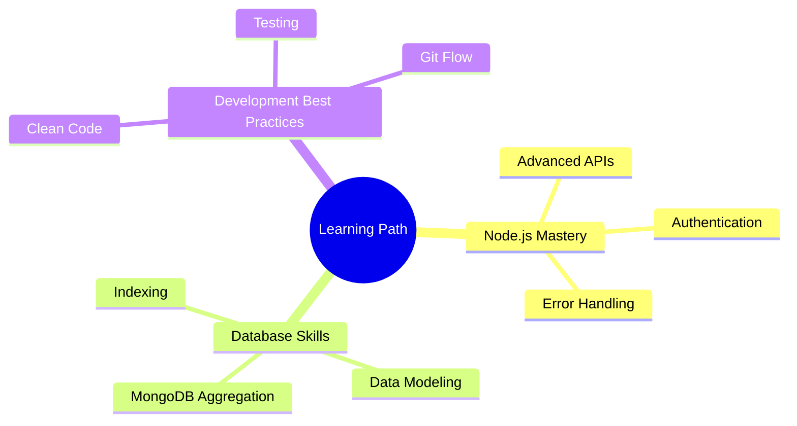

# 🚀 Hey there! I'm Spidy29 - Rising MERN Stack Developer! 

<div align="center">
  
</div>

3BjNjU5bTBoZiZlcD12MV9pbnRlcm5hbF9naWZfYnlfaWQmY3Q9Zw/bGgsc5mWoryfgKBx1u/giphy.gif" width="500" height="250"/>
</div>

## 👨‍💻 About Me
```javascript
const spidy29 = {
    experience: "10 months of passionate coding",
    currentFocus: "Building robust MERN applications",
    learning: ["Node.js", "Express.js", "MongoDB", "React.js"],
    Knowledge: ["Java", "REST APIs", "Git"],
    passion: "Creating efficient backend solutions",
    goals: ["Master Node.js", "Build scalable applications", "Learn system design"]
};
```

## 🌱 My Learning Journey

<table>
  <tr>
    <td width="50%">
      <h3 align="center">Primary Stack</h3>
      <p align="center">
        
        <br>
        <b>MERN Stack Development</b>
      </p>
    </td>
    <td width="50%">
      <h3 align="center">Exploring</h3>
      <p align="center">
        
        <br>
        <b>System Design & Architecture</b>
      </p>
    </td>
  </tr>
</table>

## 🛠️ Tech Stack & Tools

### Core Stack


### Languages


### Tools & Platforms


## 📊 My Development Journey So Far

<div align="center">
  
</div>

<div align="center">
  
</div>

## 🌟 Current Learning Goals



## 🚀 Projects I'm Working On
```javascript
const projects = [
    {
        name: "API Development",
        status: "Learning & Building",
        focus: ["RESTful APIs", "CRUD Operations", "Express.js"]
    },
    {
        name: "Database Management",
        status: "Exploring",
        focus: ["MongoDB", "Data Modeling", "Queries"]
    }
];
```

## 🤝 Let's Connect!

<div align="center">
  <a href="https://linkedin.com/in/arjun2903" target="_blank">
    
  </a>
  <a href="mailto:ar29061999@gmail.com">
    
  </a>
</div>

## 💡 What I'm Learning Right Now

<div align="center">
  
</div>

## ⚡ Fun Fact
```javascript
// My daily routine
const dailyRoutine = () => {
    const activities = ['Code', 'Learn', 'Debug', 'Repeat'];
    while (true) {
        activities.forEach(activity => console.log(`Currently: ${activity}ing`));
    }
}
// Running since starting my dev journey...
```

<div align="center">
  
</div>

---

## 🎨 My Contribution Graph

<div align="center">
  
</div>

## 🎬 Programming Humor

<div align="center">
  
</div>

<div align="center">
  
  
</div>

## 🌈 Coding Stats

<div align="center">
  
</div>

<div align="center">
  
  
</div>

## 🎯 Development Quote of the Day

<div align="center">
  
</div>

---
⭐️ From [Spidy29](https://github.com/Spidy29) - Passionate MERN Stack Developer 🚀
